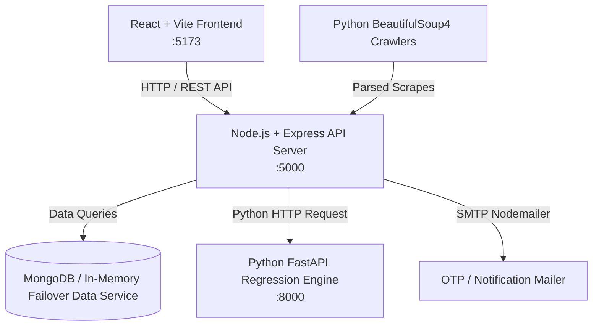

# 🏢 Property Intelligence — India Real Estate Market Intelligence Platform

**Property Intelligence** is an end-to-end real estate market intelligence, official registry verification, price forecasting, and fraud detection platform tailored for the Indian real estate ecosystem. It aggregates data across official **RERA (Real Estate Regulatory Authority)** registries, government land registry circle rates, builder track records, and historical market transactions to empower buyers, investors, financial institutions, and regulators.

---

## 📑 Table of Contents

- [Features Overview](#-features-overview)
- [System Architecture](#-system-architecture)
- [Project Directory Structure](#-project-directory-structure)
- [Tech Stack](#-tech-stack)
- [Getting Started & Installation](#-getting-started--installation)
  - [Prerequisites](#prerequisites)
  - [Quick Start (Automated PowerShell Runner)](#1-quick-start-automated-powershell-runner)
  - [Manual Service-by-Service Setup](#2-manual-service-by-service-setup)
- [Configuration & Environment Variables](#-configuration--environment-variables)
- [API Documentation](#-api-documentation)
  - [Backend Express API (`http://localhost:5000/api`)](#backend-express-api-httplocalhost5000api)
  - [AI Python Service (`http://localhost:8000`)](#ai-python-service-httplocalhost8000)
- [Background Workers & Scraper Engine](#-background-workers--scraper-engine)
- [Database & Dynamic Offline Failover](#-database--dynamic-offline-failover)

---

## ✨ Features Overview

1. 🔍 **RERA Registry Explorer & Verification**:
   - Verify official project registrations across state authorities (**GujRERA**, **MahaRERA**, **HRERA**, **UP-RERA**, **K-RERA**).
   - Real-time checks for registration status, promoter background, escrow account compliance, structural audit status, and completion deadlines.

2. 🏗️ **Builder & Developer Track Record Index**:
   - Comprehensive builder profiles, total delivered vs. ongoing projects.
   - Financial risk ratings, litigation counts, average project delay index, and customer sentiment scores.

3. 📜 **Land Registry & Official Circle Rate Tracker**:
   - Compare government-notified circle rates (Jantar Mantri / Ready Reckoner rates) against prevailing market transaction rates across states, districts, and sub-divisions.

4. 📈 **AI-Powered Price Forecasting Engine**:
   - Scikit-learn Ordinary Least Squares (OLS) Linear Regression model predicting property price trends across **6-month**, **1-year**, and **5-year** horizons with R² model fit metrics and growth probability.

5. 🛡️ **Rule-Based Fraud Detection & Anomaly Scanner**:
   - Detects suspicious transactions, circle rate vs. sale value discrepancies, duplicate RERA registrations, promoter identity mismatches, and abnormal transaction velocity.

6. 📊 **Analytics & Market Comparisons**:
   - Micro-market growth tracking, infra corridor impact (Metro, Expressway, Airport proximity), rental yields, and multi-city comparative metrics.

7. 🔖 **User Watchlist & Alert System**:
   - Authenticated bookmarking system allowing users to save, track, and monitor target projects, builders, and localities.

8. ⚙️ **Admin Command & System Controls**:
   - Monitor database connections, crawler sync jobs, system error logs, and trigger manual RERA data scraping tasks.

9. 💡 **Buyer & Investor Guidance Center**:
   - Comprehensive interactive guides, step-by-step due diligence checklists, tax calculators, legal frameworks, and circle rate cheat sheets.

---

## 📐 System Architecture



---

## 📂 Project Directory Structure

```text
RE/
├── package.json               # Root npm workspace commands
├── run-dev.ps1                # Automated PowerShell multi-service launcher script
│
├── backend/                   # Node.js + Express REST API Server
│   ├── .env                   # Environment variables (Port, Mongo URI, JWT, Mailer)
│   ├── package.json           # Backend dependencies & npm scripts
│   └── src/
│       ├── server.js          # Express app entry point & background worker loop
│       ├── seed.js            # Database seeder script
│       ├── config/            # DB connection, Mailer & Dynamic Data Service
│       ├── controllers/       # Business logic (Auth, RERA, Builder, Analytics, Fraud, etc.)
│       ├── middleware/        # JWT Authentication & Admin Authorization
│       ├── models/            # Mongoose Schemas (User, RERAProject, Builder, Transaction, etc.)
│       ├── routes/            # Unified API Route definitions (/api)
│       └── mockData.js        # High-fidelity offline fallback dataset
│
├── frontend/                  # React + Vite Client Application
│   ├── package.json           # Frontend dependencies (React, Vite, Recharts, Lucide, Tailwind)
│   ├── vite.config.js         # Vite configuration
│   └── src/
│       ├── main.jsx           # React app DOM mounting point
│       ├── App.jsx            # Core application layout, tab router, state management
│       ├── apiService.js      # Centralized HTTP API client with offline fallback support
│       ├── mockFrontendData.js# Standalone client-side fallback data
│       └── pages/             # Modular UI view tabs
│           ├── OverviewTab.jsx     # Main Dashboard KPIs & Activity
│           ├── RERATab.jsx          # Project Search & Verification
│           ├── BuildersTab.jsx      # Builder Performance & Profiles
│           ├── CircleRatesTab.jsx   # Land Registry & Government Rates
│           ├── ForecastTab.jsx      # AI Price Prediction & Regression
│           ├── GrowthTab.jsx        # Micro-Market & Infrastructure Corridors
│           ├── ComparisonTab.jsx    # City-by-City Metrics
│           ├── FraudTab.jsx         # Fraud Scanner & Anomalies
│           ├── HistoricalTab.jsx    # Price History & Volume Graphs
│           ├── GuidanceTab.jsx      # Due Diligence & Buyer Guides
│           ├── WatchlistTab.jsx     # Saved Items & User Bookmarks
│           ├── AdminTab.jsx         # System Health & Crawler Controls
│           └── SettingsTab.jsx      # User Profile & Preferences
│
├── ai-service/                # Python FastAPI Machine Learning Service
│   ├── main.py                # Scikit-Learn OLS Linear Regression service (:8000)
│   └── requirements.txt       # Python dependencies (FastAPI, Scikit-Learn, Pandas, NumPy)
│
└── data-collector/            # Web Scraping & Data Extraction Engine
    ├── crawler.py             # BeautifulSoup4 RERA portal scraper (GujRERA, MahaRERA)
    └── requirements.txt       # Crawler dependencies (BeautifulSoup4, LXML, Requests)
```

---

## 🛠️ Tech Stack

| Domain | Technology | Details |
| :--- | :--- | :--- |
| **Frontend** | React 18, Vite | High-performance SPA with HMR |
| **Styling & UI** | Tailwind CSS, Lucide React, Recharts | Modern dark/light responsive interface & chart visualizers |
| **Backend API** | Node.js, Express.js | REST API with rate limiting, CORS, and Express router |
| **Database** | MongoDB / Mongoose | MongoDB database with seamless dynamic offline fallback |
| **Authentication** | JWT & BcryptJS | Secure token authentication & password hashing |
| **AI / ML Engine** | Python 3, FastAPI, Scikit-Learn | OLS Linear Regression for 6M/1Y/5Y market forecasting |
| **Web Crawlers** | Python 3, BeautifulSoup4, LXML | Public regulatory registry parsing engine |

---

## 🚀 Getting Started & Installation

### Prerequisites

Ensure you have the following installed on your machine:
- **Node.js**: v18.0.0 or higher
- **npm**: v9.0.0 or higher
- **Python**: v3.9 or higher (for AI Service & Scraper engine)
- **MongoDB**: (Optional) Local MongoDB running on `mongodb://127.0.0.1:27017` or MongoDB Atlas URI. *Note: If MongoDB is unavailable, the backend automatically switches to offline dataset failover.*

---

### 1. Quick Start (Automated PowerShell Runner)

On Windows systems, you can launch both the **Backend** and **Frontend** servers with a single command:

```powershell
.\run-dev.ps1
```

The script automatically:
1. Verifies and installs missing `node_modules` for both `backend` and `frontend`.
2. Checks local MongoDB availability.
3. Spawns the Express backend server on `http://localhost:5000`.
4. Spawns the Vite frontend client on `http://localhost:5173`.

---

### 2. Manual Service-by-Service Setup

#### Root Dependency Helper
Install dependencies across all Node subpackages:
```bash
npm run install-all
```

#### Backend Setup
```bash
cd backend
npm install
npm run seed     # Populate initial seed data into database/mock service
npm run dev      # Start Express server via Nodemon on http://localhost:5000
```

#### Frontend Setup
```bash
cd frontend
npm install
npm run dev      # Start Vite dev server on http://localhost:5173
```

#### AI Forecasting Service Setup
```bash
cd ai-service
pip install -r requirements.txt
python main.py   # Starts FastAPI server on http://127.0.0.1:8000
```

#### Data Collector / Crawler Execution
```bash
cd data-collector
pip install -r requirements.txt
python crawler.py # Runs GujRERA and MahaRERA parsing pipelines
```

---

## ⚙️ Configuration & Environment Variables

Create or edit `backend/.env` with your local settings:

```env
PORT=5000
MONGODB_URI=mongodb://127.0.0.1:27017/real_estate_db
JWT_SECRET=your_secure_jwt_secret_key
GMAIL_USER=your_email@gmail.com
GMAIL_PASS=your_app_password
```

---

## 📡 API Documentation

### Backend Express API (`http://localhost:5000/api`)

| Method | Endpoint | Description | Auth Required |
| :--- | :--- | :--- | :--- |
| **POST** | `/api/auth/register` | Register a new user account | No |
| **POST** | `/api/auth/login` | Login user & return JWT token | No |
| **POST** | `/api/auth/verify-otp` | Verify email OTP | No |
| **GET** | `/api/auth/me` | Get active user profile | Yes |
| **GET** | `/api/rera/projects` | Query & filter RERA projects | No |
| **GET** | `/api/rera/projects/:id` | Get detailed RERA project profile | No |
| **GET** | `/api/builders` | Get list of tracked real estate builders | No |
| **GET** | `/api/builders/:id` | Get builder track record & litigation count | No |
| **GET** | `/api/transactions` | Query land transaction records | No |
| **GET** | `/api/transactions/circle-rates` | Fetch state/district circle rates | No |
| **GET** | `/api/analytics/forecast` | Fetch price forecast metrics | No |
| **GET** | `/api/analytics/city-comparison` | Compare market parameters across cities | No |
| **GET** | `/api/fraud/reports` | Get active fraud detection reports | No |
| **GET** | `/api/fraud/scan` | Trigger real-time anomaly scanning | No |
| **GET** | `/api/watchlist` | Get user saved items | Yes |
| **POST** | `/api/watchlist/add` | Add project/builder to user watchlist | Yes |
| **POST** | `/api/watchlist/remove` | Remove item from user watchlist | Yes |
| **GET** | `/api/admin/health` | System health diagnostics | Admin Only |
| **POST** | `/api/admin/sync` | Manually trigger crawler sync | Admin Only |

### AI Python Service (`http://localhost:8000`)

| Method | Endpoint | Parameters | Description |
| :--- | :--- | :--- | :--- |
| **GET** | `/api/health` | - | Service operational status check |
| **GET** | `/api/forecast` | `city`, `locality` | Returns OLS linear regression forecast (6M, 1Y, 5Y), R² score, and historical plot data |

---

## 🔄 Background Workers & Scraper Engine

The backend incorporates an automated **Background Scraper Loop** (`server.js`) that runs every 60 seconds to simulate real-time state regulatory table polling. It periodically adds system event logs and simulates incremental data updates for Gujarat RERA and Maharashtra MahaRERA databases.

The standalone Python web scraper (`data-collector/crawler.py`) demonstrates HTML table DOM extraction using BeautifulSoup4 and LXML for extracting regulatory registration numbers, promoter details, district allocations, and registration timestamps.

---

## 🛡️ Database & Dynamic Offline Failover

The platform features a **Dynamic Data Service Architecture** (`backend/src/config/dataService.js`). 
- When MongoDB is active, standard Mongoose models handle persistent CRUD operations.
- If MongoDB is disconnected or offline, the platform automatically switches to an in-memory data handler powered by high-fidelity dataset mocks (`backend/src/mockData.js`). This ensures zero downtime during offline testing or local developer demonstrations.

---

## 📄 License & Maintainers

Developed for real estate market transparency, regulatory compliance, and analytics across India.
